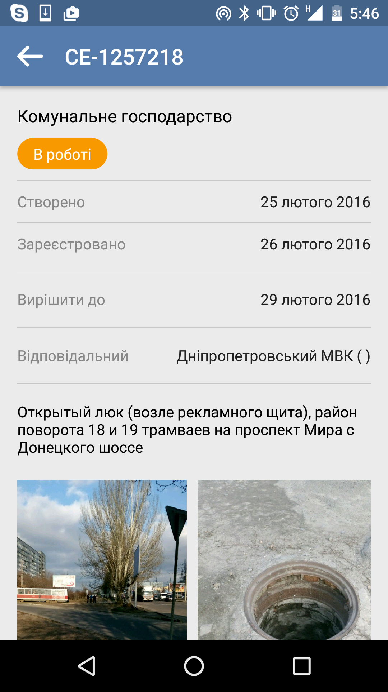
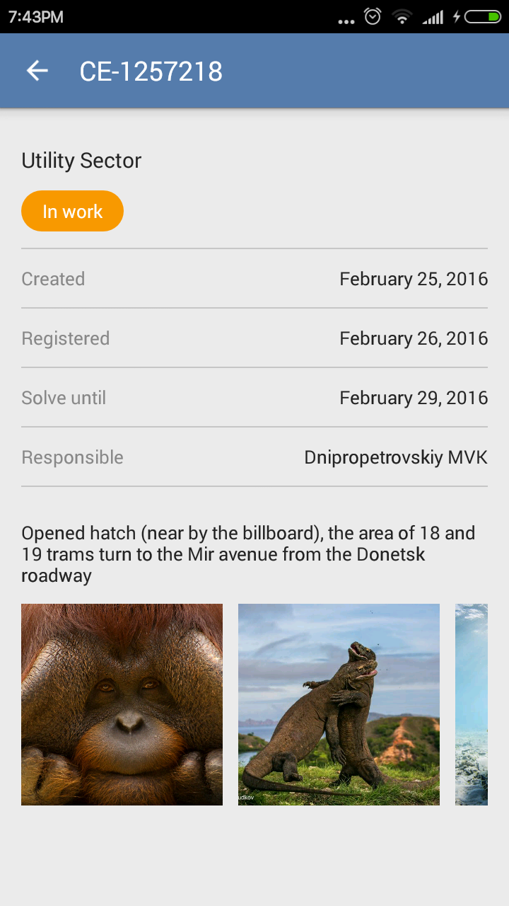
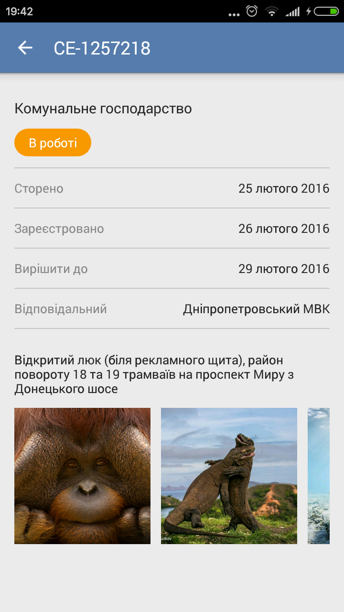

Yalantis Android Internship. Task 1
===================================

***Android internship tasks***

Create screen with controls

It should be screen with ScrollView, textviews and  horizontal recycler view with images

***Requirments:***

* Put dimens and text sizes into res folder
* Minimal SDK version = 16
* Only portrait orientation
* For image loading use one of third party libraries 
* Support different screen sizes
* Use styles 
* Back button should close application
* Ukrainian and English localization should be included
* When user presses any control, show toast with control name
* Project should be pushed into github.com / bitbucket
* Use [google code style](https://source.android.com/source/code-style.html)
* Also you should find UI mistakes, suggest how to solve it

______

My result:
==========

 

***Possible mistakes on the example screen:***

* Home up (back) button is too large and, respectively,  doesn't feet guidelines
* Different distance between separators and their thickness
* Description in Russian :)